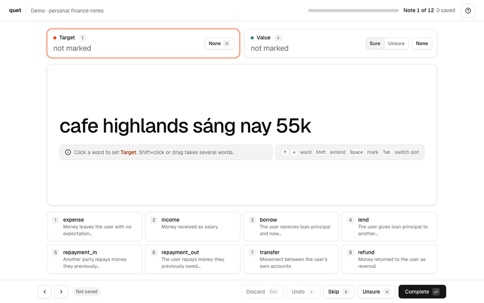
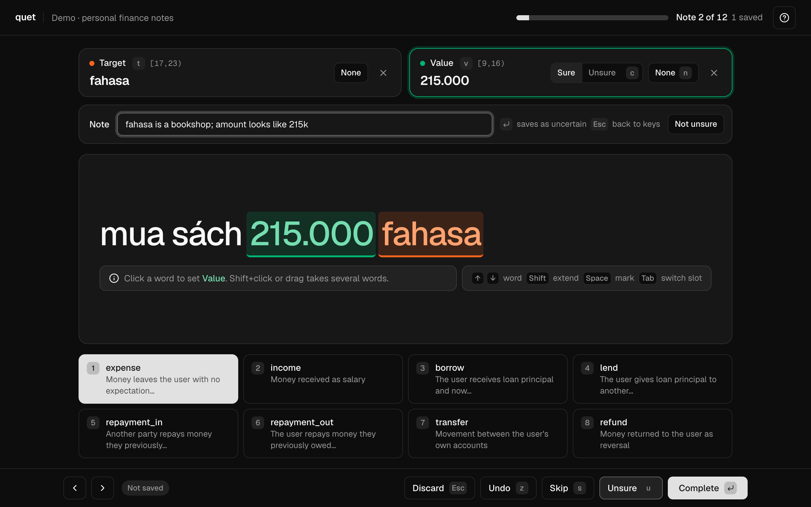
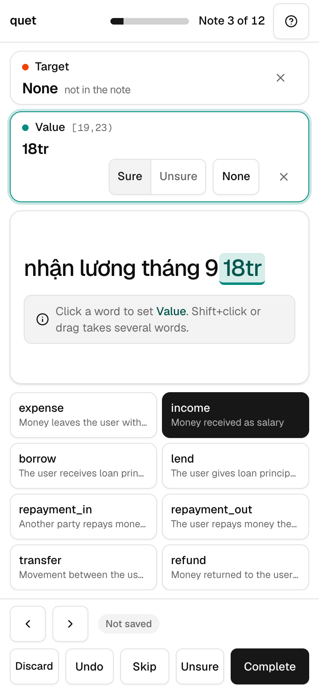

# quet-web

quet-web is the web companion of [Quet](https://github.com/8bu/quet), the terminal labelling tool (quet-tui).
Outside collaborators use it to label text in a browser. They do not need to install Quet.
It runs on a Cloudflare Worker with a D1 database at `quet.8bu.dev`.



## How it works

1. The owner pushes a project from Quet: `quet web push`.
2. The owner creates a collaborator account in the admin dashboard (`/admin`) and assigns the project.
3. The collaborator signs in and labels the notes in the browser.
4. The owner pulls the labels back to Quet: `quet web pull`. The labels use the same format as `quet annotate`.

## Access

- **Admin:** Cloudflare Access protects the dashboard and the admin API. The Quet CLI uses a service token.
- **Collaborators:** username and password, with a session cookie.

## Labelling screen

- One screen. No scroll on desktop or phone.
- Click a word to mark a span. Shift+click or drag marks several words.
- Number keys pick the type. Enter saves and opens the next note.
- Unsure labels and unsure spans need a note.

| Unsure label with a note (dark mode) | Phone |
| --- | --- |
|  |  |

The demo is also a video: [docs/media/labeller-demo.mp4](docs/media/labeller-demo.mp4).

## Development

```sh
npm install
cp .dev.vars.example .dev.vars
npm run migrate:local
npm run dev
```

Run the checks with `npm run typecheck` and `npx vitest run`. Deploy with `npm run deploy`.

## Docs

- [docs/contract.md](docs/contract.md): API, D1 schema, label format, and labelling screen.
- [docs/deploy.md](docs/deploy.md): Cloudflare setup and production checks.
- [docs/research/](docs/research/): research for the labelling screen.
- [prototypes/](prototypes/): design prototypes of the labelling screen.
- Quet CLI and TUI: [8bu/quet](https://github.com/8bu/quet) (`quet web` commands).
